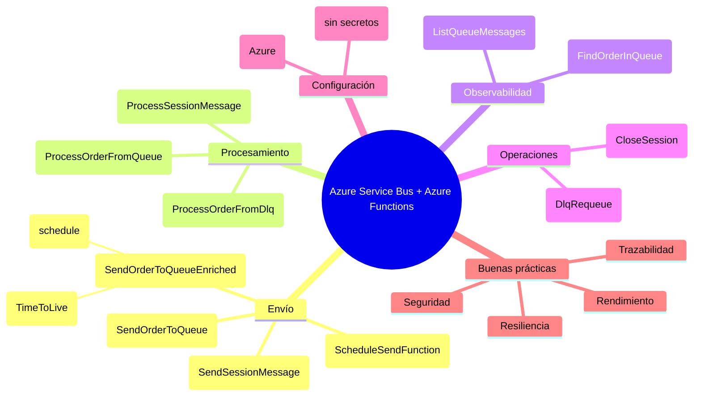

# FunctionAppDemoQueue

Laboratorio práctico y guía para dominar Azure Service Bus con Azure Functions (.NET 8, v4, in-proc).
Incluye envío (simple/enriquecido/programado), procesamiento (cola activa/DLQ/sesiones), inspección (peek), búsqueda, reenvío desde DLQ y ejemplos de sesiones.

Mapa mental (visión general)


Tecnologías
- .NET 8
- Azure Functions v4 (in-proc)
- Paquetes
  - Microsoft.Azure.WebJobs.Extensions.ServiceBus 5.14.0
  - Azure.Messaging.ServiceBus 7.17.4

Configuración (local)
- Copia local.settings.template.json a local.settings.json y completa ServiceBusConnection (sin EntityPath)
- Claves usadas
  - ServiceBusConnection: Endpoint=sb://<namespace>...;SharedAccessKeyName=...;SharedAccessKey=...
  - ServiceBusQueueName: cola principal (ej. sbq-boleta)
  - ServiceBusSessionQueueName: cola con sesiones habilitadas (creada en Azure)
- Importante: local.settings.json está ignorado por .gitignore (no subas secretos)

Ejecutar local
- dotnet build
- func start
- Base URL: http://localhost:7071

Catálogo de funciones y rutas
1) Envío
- POST /api/orders/send
  - Envía cuerpo JSON como texto a la cola
- POST /api/orders/send-enriched?ttlSeconds=7200&scheduleInSeconds=300
  - Enriquecido: MessageId/CorrelationId = cabecera.numeroPedido, ApplicationProperties (numeroPedido, createdAtUtc/Local)
  - Opcional: TTL (ttlSeconds), envío programado (scheduleInSeconds)
- POST /api/queue/schedule?scheduleInSeconds=N
  - Programación directa via SDK

2) Procesamiento
- ProcessOrderFromQueue (trigger cola activa)
- ProcessOrderFromDlq (trigger DLQ): registra motivo y contenido; punto de remediación

3) Observabilidad (peek, no consume)
- GET /api/queue/list?top=50&from=0&deadletter=false&maxBody=2048
  - Devuelve metadatos: enqueuedTime, expiresAt, scheduledEnqueueTime, lockedUntil, messageId, subject, properties y body truncado
- GET /api/orders/find/{numeroPedido}?max=500&deadletter=false
  - Busca por ApplicationProperties.numeroPedido o JSON cabecera.numeroPedido

4) Operaciones
- POST /api/dlq/requeue?messageId=... | numeroPedido=...&max=500
  - Clona mensaje desde DLQ a cola activa (no elimina el original para seguridad)

5) Sesiones (orden por SessionId)
- POST /api/sessions/send/{sessionId}
  - Envía mensaje con SessionId a ServiceBusSessionQueueName
- ProcessSessionMessage (trigger con IsSessionsEnabled=true)
  - Usa ServiceBusSessionMessageActions (p. ej. renovar lock)
- POST /api/sessions/close/{sessionId}
  - Acepta y cierra una sesión explícitamente

Comandos de prueba (curl)
- Envío simple
  curl -X POST http://localhost:7071/api/orders/send -H "Content-Type: application/json" -d @pedido.json
- Envío enriquecido (TTL 2h, schedule 5 min)
  curl -X POST "http://localhost:7071/api/orders/send-enriched?ttlSeconds=7200&scheduleInSeconds=300" -H "Content-Type: application/json" -d @pedido.json
- Listar mensajes (body y metadatos)
  curl "http://localhost:7071/api/queue/list?top=50&maxBody=2048"
- Buscar por numeroPedido
  curl "http://localhost:7071/api/orders/find/12345?max=500"
- Reenviar desde DLQ
  curl -X POST "http://localhost:7071/api/dlq/requeue?messageId=12345"
- Enviar con sesión
  curl -X POST http://localhost:7071/api/sessions/send/mi-sesion -H "Content-Type: application/json" -d '{"hola":"mundo"}'

Conceptos clave (Service Bus)
- EnqueuedTime: momento UTC en que el broker acepta el mensaje (no configurable)
- ScheduledEnqueueTime: programación para que el mensaje aparezca en la cola
- TimeToLive (TTL) / ExpiresAt: caducidad del mensaje
- DLQ: cola de mensajes muertos por errores, vencimiento o dead-letter explícito
- Duplicate Detection: idempotencia (MessageId)
- ApplicationProperties: metadatos de negocio (ej. numeroPedido)
- Sessions: orden por SessionId y afinidad de procesamiento
- Peek: inspección sin consumir (útil para diagnóstico y auditoría)

Buenas prácticas
- Seguridad
  - No subas secretos; usa App Settings y/o Azure Key Vault
  - Preferir Managed Identity (Azure) sobre cadenas de conexión
- Trazabilidad
  - MessageId/CorrelationId con claves de negocio
  - Logs estructurados, correlación, Azure Monitor
- Resiliencia
  - Reintentos, manejo de DLQ, flujos de remediación
  - Evita bucles de reencolado (marca intentos en propiedades)
- Rendimiento
  - Prefetch y concurrencia (host.json), envío en lotes, transacciones
  - Claim-check para payloads grandes (Blob + referencia)

Sugerencia de tuning (host.json)
```jsonc
{
  "version": "2.0",
  "extensions": {
    "serviceBus": {
      "prefetchCount": 100,
      "messageHandlerOptions": {
        "maxConcurrentCalls": 16,
        "autoCompleteMessages": true
      }
    }
  }
}
```

Ejemplo de payload de pedido
{
  "cabecera": {
    "numeroPedido": "12345",
    "fecha": "2025-09-01",
    "cliente": { "id": "C001", "nombre": "Juan Pérez", "direccion": "Av. Ejemplo 123, Ciudad" },
    "total": 150.75,
    "moneda": "USD"
  },
  "detalle": [
    { "codigoProducto": "P1001", "descripcion": "Camisa manga larga", "cantidad": 2, "precioUnitario": 35.00, "subtotal": 70.00 },
    { "codigoProducto": "P1002", "descripcion": "Pantalón jeans", "cantidad": 1, "precioUnitario": 55.75, "subtotal": 55.75 },
    { "codigoProducto": "P1003", "descripcion": "Zapatos deportivos", "cantidad": 1, "precioUnitario": 25.00, "subtotal": 25.00 }
  ]
}

Despliegue a Azure (resumen)
- Crear Function App (.NET), Storage y Service Bus
- Configurar App Settings: ServiceBusConnection, ServiceBusQueueName, ServiceBusSessionQueueName
- Publicar con VS/Azure DevOps/GitHub Actions (recomendado)

Limitaciones y notas
- No hay búsqueda server-side en colas; FindOrderInQueue usa peek secuencial
- EnqueuedTime es UTC y lo define el broker
- DlqRequeue clona el mensaje; el original queda en DLQ (evita pérdidas)

Autor
- eincioch
